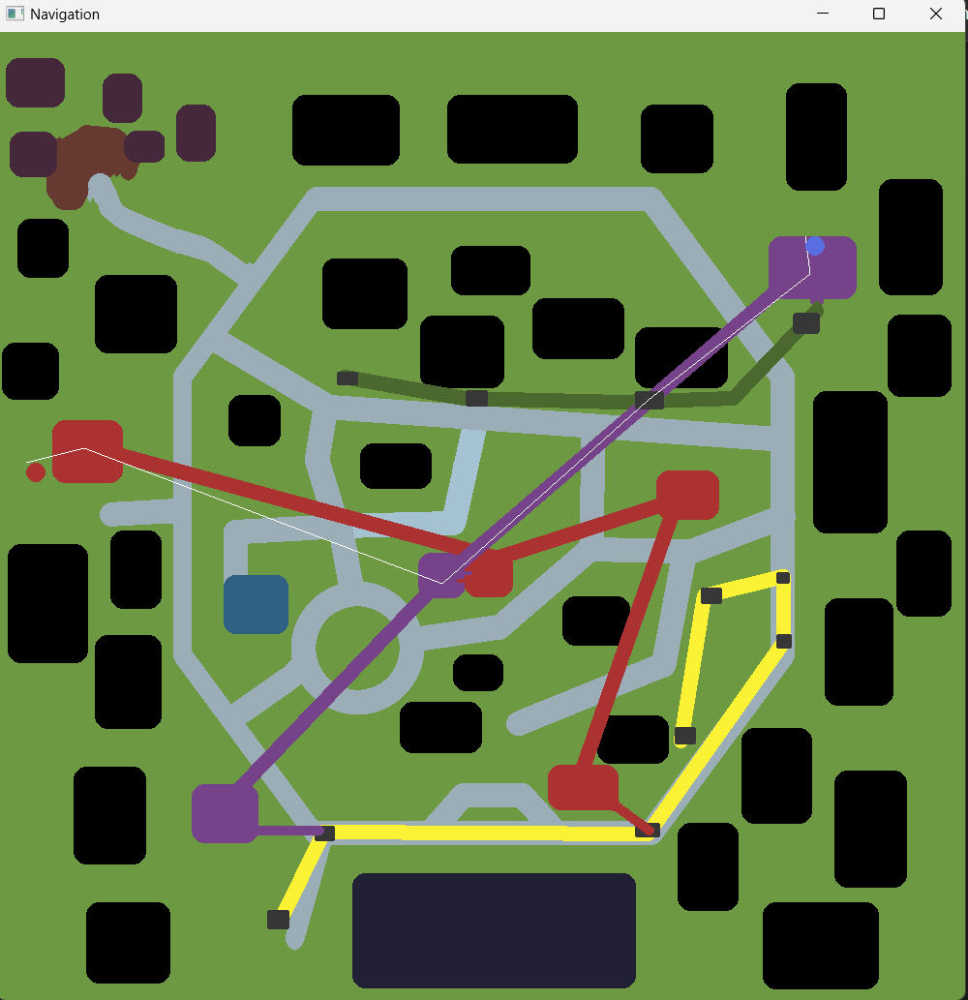
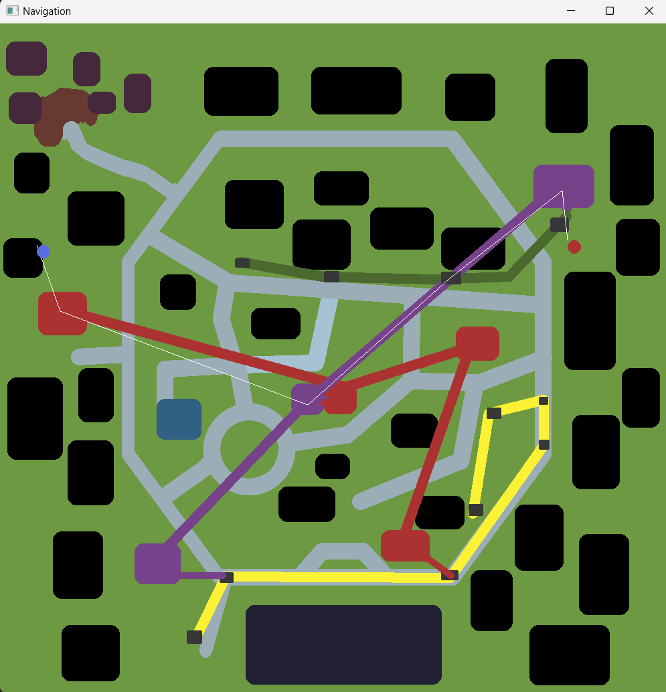
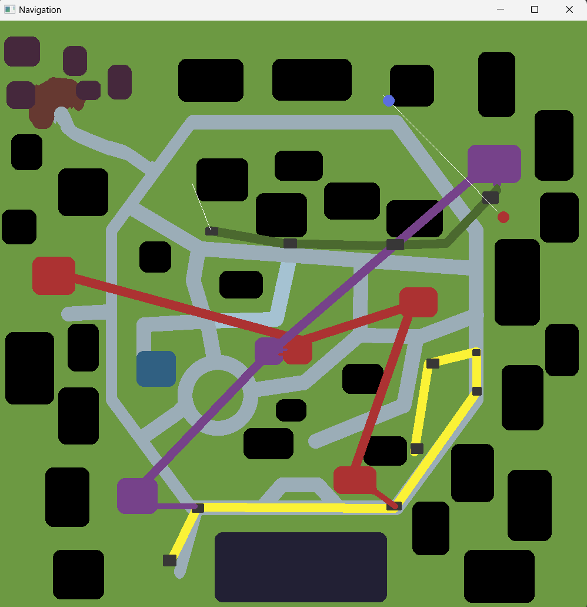
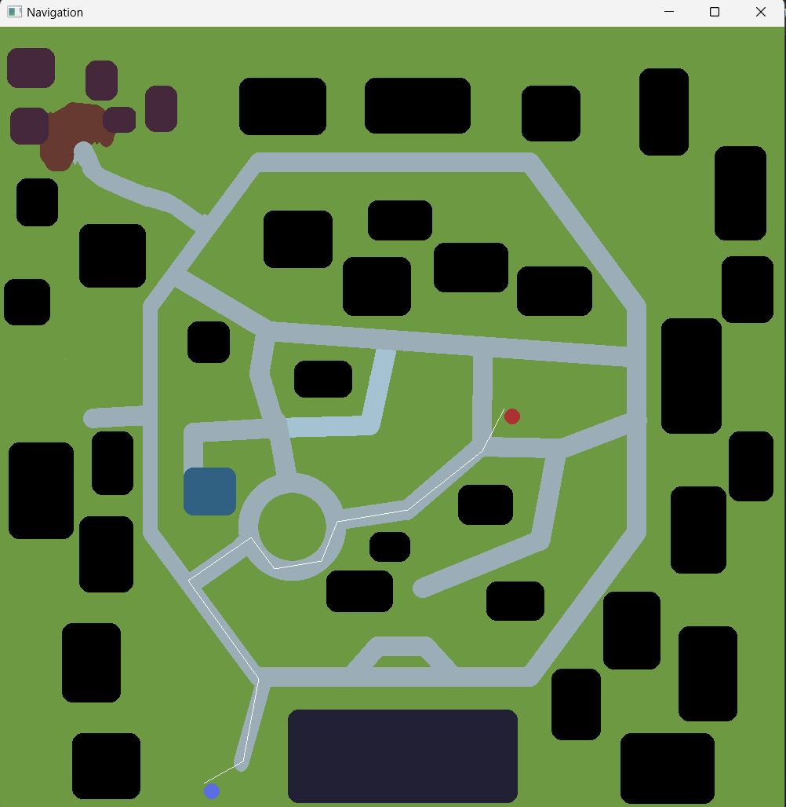
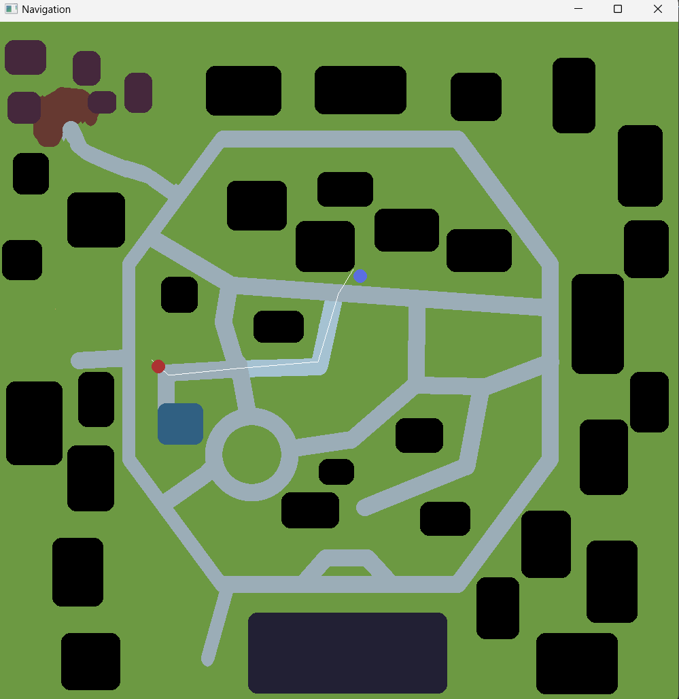
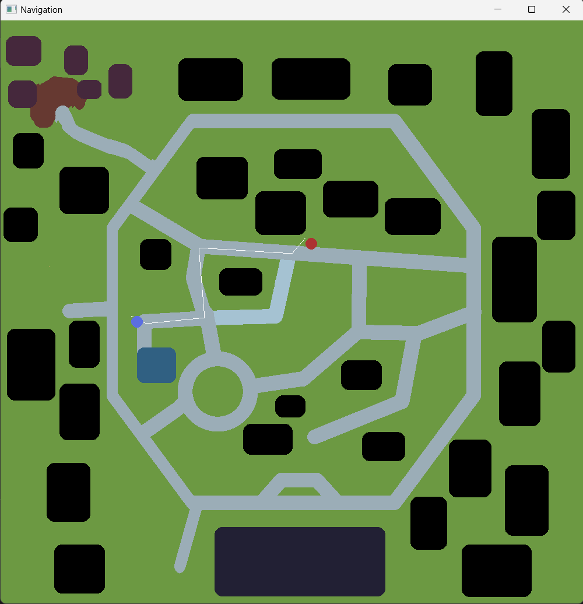

# Map based on Dijkstra algorithm 
This project is fully based on Dijkstra algorithm, which in its turn based on graphs. All graphs were entered manually and map was created in Aseprite.
It was created with C++ and SFML. If there are any bugs, they are high likely are caused by SFML itself. 

## About code 

Function `readWay()` reads the data from .way files(artificially created type).

Function `findShortestPath()` is the main function which starts the main algorithm. 

In my opinion others are pretty clear and do not require any additional explanations. 

To check this project out:
Firstly choose the starting point by `left` clicking.
Secondly choose the destination by `right` clicking.
Thirdly and optionally by clicking spacebar you can change modes from `on feet` to `by car`.

## Examples 

